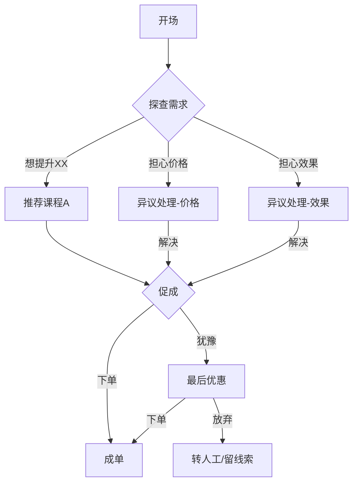

# 在线教育课程销售智能体话术 SOP 设计

## 核心工作流

```
用户输入（课程信息 + 目标学员 + 销售目标）
    │
    ▼
检查关键信息是否齐全
    │
    ├── 核心信息齐全 → 直接进入设计
    ├── 缺少非核心信息 → 基于常识补全，标注 [假设]
    └── 缺少核心信息 → 一次性列出缺失项询问
    │
    ▼
提取课程核心卖点与目标学员痛点
    │
    ▼
绘制话术流程分支图（Mermaid 格式）
    │
    ▼
逐节点输出标准话术文案
    │
    ▼
补充异议处理话术库
    │
    ▼
生成话术 SOP 文档
```

---

## 输入模板

用户需提供：

| 字段 | 是否必填 | 说明 |
|------|---------|------|
| 课程名称 | ✅ 必填 | 课程全称 |
| 课程核心卖点 | ✅ 必填 | 1-3 条，用"解决了什么问题"描述 |
| 目标学员 | ✅ 必填 | 具体人群，如"想转行 AI 的运营人" |
| 销售目标 | 🔶 建议提供 | 课程价格、优惠信息 |
| 现有话术参考 | 🔶 可选 | 竞品话术截图或文档 |
| 异议场景 | 🔶 可选 | 学员最常问的 3 个问题 |

---

## 防呆规则

**缺少核心信息（课程名称/卖点/目标学员）时：**
→ 一次性列出所有缺失项，等用户补充，不逐条追问。

**缺少非核心信息时：**
→ 基于已有课程信息推断补全，在话术开头标注：
```
[假设：课程定价为 XX元，基于用户描述推断，建议确认后更新]
```

**用户提供信息极少时（如只说"帮我写个卖课话术"）：**
→ 输出前先反问确认：
```
帮我确认一下：
- 是什么课程？
- 主要卖给谁？
- 有什么核心卖点？
确认后我马上出完整话术。
```

---

## 话术流程节点（标准结构）

每个节点需包含：触发条件 → Agent 说 → 用户可能的回复 → 分支处理

1. **开场破冰**：打招呼 + 抛出钩子问题
2. **需求探查**：了解学员现状与痛点
3. **课程推荐**：自然引出课程核心价值
4. **异议处理**：价格/时间/效果/信任类异议
5. **促成下单**：紧迫感 + 限时优惠
6. **话术边界**：转人工条件说明

---

## 输出格式

### 1. 话术分支流程图（Mermaid）



### 2. 各节点标准话术（Markdown 表格）

| 节点 | Agent 说 | 用户可能回复 | 分支处理 |
|------|---------|------------|---------|
| 开场 | "你好！看到你在了解 XX 方向，想聊聊你现在的情况吗？" | | |

### 3. 异议处理话术库

| 异议类型 | 用户原话示例 | Agent 回应 |
|---------|------------|---------|
| 价格类 | "太贵了" | 见下方标准回应 |
| 效果类 | "学完能找到工作吗" | 见下方标准回应 |
| 时间类 | "没时间学" | 见下方标准回应 |

### 4. 话术边界说明

明确以下情况需转人工：
- 用户明确表示投诉意愿
- 涉及退费/法律/合同问题
- 连续 3 次触发异议处理仍不成单

---

## 质量检查

- [ ] 话术流程覆盖完整（开场→探需→推荐→异议→促成→结束）
- [ ] 每个分支有明确处理逻辑，不存在"死路"
- [ ] 异议处理话术库覆盖价格/效果/时间/信任四类
- [ ] 话术语言亲切自然，不 hard sell
- [ ] 边界说明清晰，转人工条件明确
